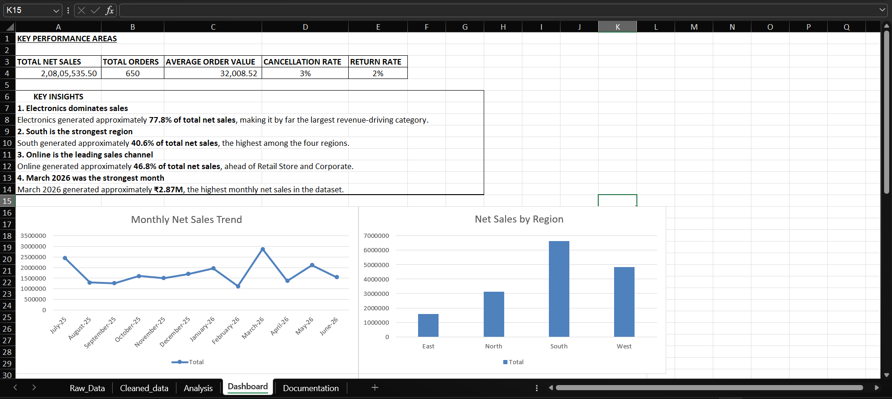

# retail-sales-analysis-excel
Retail sales analysis and dashboard built with Microsoft Excel
# Retail Sales Analysis & Excel Dashboard

## Project Overview

This project analyzes a retail sales dataset containing 650 orders from July 2025 to June 2026.

The goal was to understand sales performance across regions, product categories, sales channels, order status, and monthly trends using Microsoft Excel.

## Tools Used

- Microsoft Excel
- Excel Tables
- Data Cleaning
- PivotTables
- PivotCharts
- Excel Formulas
- KPI Analysis
- Data Visualization

## Analysis Performed

The analysis focused on:

- Total net sales
- Total orders
- Average order value
- Monthly sales trends
- Regional sales performance
- Category performance
- Sales channel performance
- Order cancellations and returns

## Dashboard

The final dashboard includes five key performance indicators:

- Total Net Sales
- Total Orders
- Average Order Value
- Cancellation Rate
- Return Rate

It also includes visualizations for monthly sales, regional performance, category performance, sales channels, and order status.

### Dashboard Preview

## Key Findings

- Electronics generated approximately 77.8% of total net sales.
- South was the highest-performing region, contributing approximately 40.6% of total net sales.
- Online was the largest sales channel, contributing approximately 46.8% of total net sales.
- March 2026 recorded the highest monthly net sales.
- 616 of 650 orders were delivered, while 21 were cancelled and 13 were returned.

## Data Preparation

The raw dataset was preserved separately from the cleaned dataset.

The data preparation process included checking for duplicates, reviewing missing values and inconsistencies, and creating a `Sales_Month` field for monthly trend analysis.

## Limitations

The dataset does not contain information such as profit margins, marketing spend, inventory availability, customer feedback, or reasons for cancellations and returns.

Therefore, this project focuses on identifying sales patterns rather than determining the causes behind them.

## Project Outcome

This project helped me practice the complete Excel analytics workflow, from data preparation and validation to PivotTable analysis, KPI creation, visualization, and dashboard development.
